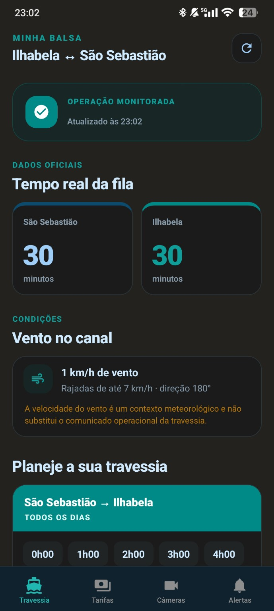
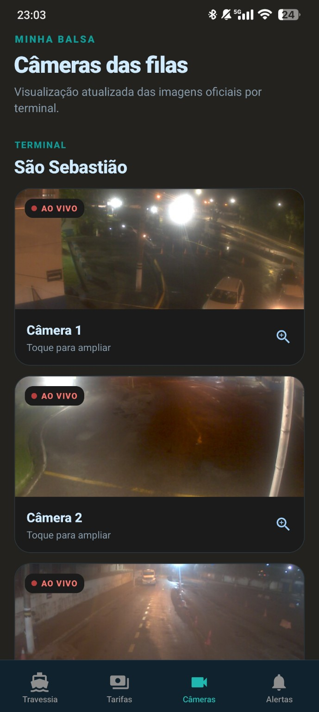

# ⛴️ Minha Balsa

### Sistema de acompanhamento da travessia do litoral norte e sul


Informações da travessia, tempo real das filas,
condições do canal, horários e câmeras dos terminais em um único
aplicativo.

------------------------------------------------------------------------

## 📱 Sobre o projeto

O **Minha Balsa** é um aplicativo desenvolvido para facilitar o
planejamento da travessia entre **Litoral Norte e Sul**, reunindo
informações relevantes em uma interface moderna e objetiva.

A proposta é permitir que o usuário consulte rapidamente a situação da
travessia antes de se deslocar até o terminal, tendo acesso a dados de
fila, condições do canal, horários e imagens das câmeras.

------------------------------------------------------------------------

## ✨ Principais funcionalidades


  ----------------------------------- -----------------------------------
  ⛴️ **Travessia**                    Acompanhamento da operação das balsas

  📊 **Tempo real da fila**           Visualização do tempo estimado de
                                      espera em cada sentido

  🌬️ **Condições do canal**           Velocidade, rajadas e direção do
                                      vento

  🗓️ **Horários**                     Consulta dos horários disponíveis
                                      para a travessia

  📹 **Câmeras**                      Visualização das imagens dos
                                      terminais

  🔔 **Alertas**                      Área destinada a avisos importantes
                                      da operação

  💰 **Tarifas**                      Área dedicada às informações de
                                      tarifas
  -----------------------------------------------------------------------

------------------------------------------------------------------------

## 🖼️ Interface

### ⛴️ Tela de Travessia


A tela principal concentra as informações mais importantes: status da
operação, atualização, tempo real das filas, condições do canal e
planejamento dos horários.

### 📹 Câmeras dos terminais

` 
A seção de câmeras permite acompanhar visualmente as condições dos
terminais, com indicação de transmissão ao vivo e opção de ampliar as
imagens.

------------------------------------------------------------------------

## 🧭 Navegação

O aplicativo foi organizado em quatro áreas principais:

**⛴️ Travessia**\
Informações gerais da operação, filas, condições do canal e horários.

**💰 Tarifas**\
Consulta das informações relacionadas às tarifas.

**📹 Câmeras**\
Imagens dos terminais para acompanhamento visual das filas.

**🔔 Alertas**\
Avisos e informações importantes para os usuários.

------------------------------------------------------------------------

## 🎨 Design

O projeto utiliza uma interface pensada para dispositivos móveis,
priorizando:

-   🌙 Tema escuro
-   📱 Layout responsivo
-   🎯 Informações organizadas por prioridade
-   🔄 Indicadores de atualização
-   🟢 Status operacionais destacados
-   📹 Visualização otimizada das câmeras
-   🧭 Navegação inferior simples e intuitiva

A identidade visual utiliza tons de **azul, ciano e verde-água**,
criando uma interface tecnológica sem comprometer a legibilidade.

------------------------------------------------------------------------

## 🚀 Objetivo

O **Minha Balsa** nasceu com o objetivo de tornar mais simples o acesso
às informações necessárias para quem utiliza ou acompanha a travessia
**do Litoral Norte e Sul**.

Em vez de consultar diferentes fontes, o usuário encontra as principais
informações em uma única experiência mobile.

------------------------------------------------------------------------

## 📌 Status do desenvolvimento

🟢 **Em desenvolvimento**

O projeto está em evolução e novas funcionalidades, melhorias de
interface e integrações poderão ser adicionadas futuramente.

------------------------------------------------------------------------

## 🛠️ Tecnologias

> As tecnologias abaixo devem ser ajustadas conforme a stack definitiva
> utilizada no projeto.

-   Android
-   Interface mobile responsiva
-   Integração com dados da travessia
-   Consumo de informações em tempo real
-   Exibição de imagens de câmeras
-   Atualização dinâmica de informações

------------------------------------------------------------------------

## 📲 Instalação

Clone o repositório:

``` bash
git clone https://github.com/SEU-USUARIO/minha-balsa.git
```

Entre na pasta:

``` bash
cd minha-balsa
```

Depois siga as instruções específicas de build e configuração
disponíveis no projeto.

------------------------------------------------------------------------

## ⚠️ Informações importantes

O aplicativo possui finalidade **informativa**.

As condições operacionais da travessia podem sofrer alterações. Em
situações de interrupção, alteração de horários ou outras ocorrências,
devem prevalecer os **comunicados oficiais da operação responsável pela
travessia**.

------------------------------------------------------------------------

### ⛴️ Minha Balsa

**Planeje sua travessia com mais informação.**

⭐ Se você gostou do projeto, considere deixar uma estrela no
repositório.
